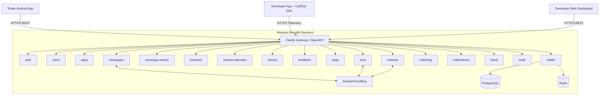

# CallTest V1 — Architecture Specification

## 1. Overview & System Topology

CallTest is a platform connecting Android application developers with real testers for 14-day closed testing cycles required for Google Play production releases.

The platform is structured as a **Modular Monolith** containing:

- **Backend (`apps/backend`)**: Fastify 5 REST API + TypeBox + PostgreSQL (Prisma) + Redis + In-Memory Domain Event Bus.
- **Android App (`apps/android/app`)**: Kotlin Jetpack Compose app for testers.
- **CallTest SDK (`apps/android/sdk`)**: Embedded client library for developer apps.
- **API Contract (`packages/api-contract`)**: Universal OpenAPI 3.0.3 contract as the single source of truth between Backend and Android.
- **Shared Types (`packages/shared-types`)**: Internal TypeScript enums and domain types.

## 2. Core Modules

Each module inside `apps/backend/src/modules/` adheres strictly to layered architecture:

- `routes.ts`: Fastify route definitions with TypeBox request/response schemas.
- `handlers.ts`: HTTP request/reply lifecycle management.
- `service.ts`: Pure business rules and orchestration.
- `repository.ts`: Persistence abstraction over Prisma Client.
- `schemas.ts`: TypeBox schema definitions.
- `*.test.ts`: Automated tests with Vitest.

## 3. Zero-Trust Client Philosophy

The backend is the sole authority for:

- Mission completion validation.
- XP and Gold rewards (strictly idempotent with unique compound keys).
- Trust score adjustments and rank recalculations.
- Campaign lifecycle transitions.
- Tester replacement assignments.
